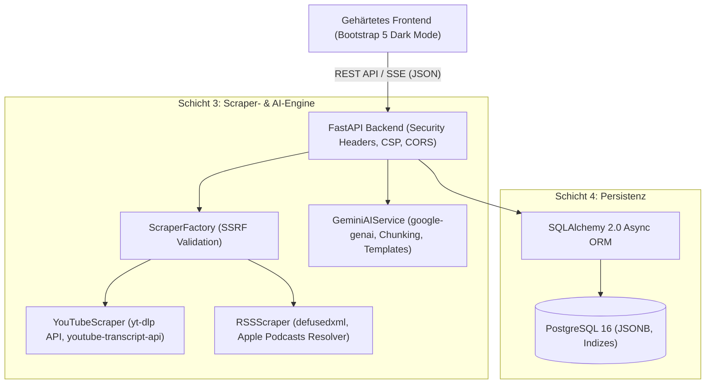

# Systemarchitektur & Modulübersicht

<!-- SPDX-License-Identifier: GPL-3.0-or-later -->
<!-- Copyright (C) 2026 Podcast & Media Channel Researcher Contributors -->

Dieses Dokument dient als zentrale Systemarchitektur-Dokumentation für Entwickler und KI-Agenten.

## 1. Systemübersicht

Der **Podcast & Media Channel Researcher & AI Analyzer** ist eine modulare, sicherheitsgehärtete Web-Applikation zur automatisierten Erfassung, Strukturierung und KI-gestützten Analyse von Podcasts und Medienkanälen (YouTube, RSS, Apple Podcasts).

## 2. Die 4 Schichten im Detail

### Schicht 1: Gehärtete Weboberfläche (Frontend)

- **Technologie:** Semantisches HTML5, Bootstrap 5 (`data-bs-theme="dark"`), Vanilla JavaScript, CSS3.
- **Sicherheitsmerkmale:**
  - Keine externen CDN-Abhängigkeiten (vollständig lokal unter `/static/vendor/` gebündelt).
  - Strikte Content Security Policy (`default-src 'self'`).
  - Schutz vor XSS durch strikte DOM-Sanitization und `textContent`/sichere DOM-Knoten-Erstellung.
- **Komponenten:**
  - **Archive Explorer Sidebar:** Liste aller erfassten Feeds mit Plattform-Badges (`[YouTube]`, `[RSS]`).
  - **2-Stufen Import- & Scraper-Panel (ADR-0005):** Schnelle Vorab-Prüfung (`/api/probe` in < 1s) mit Vorschau-Karte gefolgt von konfigurierbarem Tiefenscan (`/api/scrape`).
  - **Episoden-Explorer:** Sortierbare Tabelle mit Volltextsuche in Show Notes & Metadaten.
  - **Detail-Drawer / Offcanvas:** Show Notes, Kapitelmarken und Transkript-Viewer mit On-Demand-Fetch.
  - **Gemini Recherche-Labor:** Wikipedia-Synthese (`wikitable` / `Vorlage:Episodenliste` mit automatischem Wiki-Linking), Transkript-Volltextsuche (`/api/search/transcripts`), Executive Summary, Gäste-/Themenextraktion und Q&A.
  - **Export-Center & Webspace Publisher:** Export in CSV, JSON, Markdown, Wikitext, Wikipedia-Vorlage, Geminispace (`.gmi`, `feed.gmi`) und Gopherspace (`gophermap`).

### Schicht 2: Recherche-Archiv & Transkript-Suchindex

- Verwaltet historische Analysen und ermöglicht das sekundengenaue Durchsuchen von Volltext-Transkripten mit Direkt-Sprungmarken zu YouTube (`&t=...s`).
- Zero-Media-Storage-Prinzip: Keine Speicherung von Audio/Video-Rohdaten, reine Metadaten- und Transkript-Verarbeitung.

### Schicht 3: Modulare Scraper- & Analytik-Engine

- **Adapter-Pattern (`app/scrapers/`):**
  - `BaseScraper`: Abstrakte Schnittstelle für alle Plattformen mit `probe_feed()` und `extract_podcast_and_episodes()`.
  - `ScraperFactory`: Sichere Erkennung des Feed-Typs und Validierung der Ziel-URL gegen SSRF.
  - `YouTubeScraper`: Verwendet die interne Python-API von `yt-dlp` (keine Shell-Ausführung) und `youtube-transcript-api`.
  - `RSSScraper`: Verwendet `defusedxml` zur Absicherung von `feedparser` gegen XML-Bomben und XXE sowie Apple Podcasts Lookup.
- **Gemini AI Service (`app/gemini_service.py`):**
  - Nutzt das offizielle `google-genai` SDK.
  - Spezialisierte Prompt-Templates für Wikipedia-Tabellen (`wikitable` und `{{Episodenliste}}`), automatisches Wikilinking (`[[Name]]`), Gäste-Extraktion, Q&A und Deep Research.
  - Token-Chunking für lange Transkripte und Delta-Modus für inkrementelle Aktualisierungen.

### Schicht 4: Datenbank-Schicht (PostgreSQL 16 / SQLite)

- **ORM:** SQLAlchemy 2.0 mit vollständiger AsyncIO-Unterstützung (`asyncpg` / `aiosqlite`).
- **Tabellen:**
  - `podcasts`: Kanaldaten, Plattform (`youtube`, `rss`, `apple`), Metadaten in JSON.
  - `episodes`: Episodendaten, Show Notes, Kapitelmarken in JSON, externe IDs.
  - `transcripts`: Zeitstempelbasierte Segmente in JSON, Volltext und Sprachcode.
  - `ai_analyses`: Gespeicherte Analysen und Prompts pro Kanal/Episode.
- **Flexibilität:** Standardmäßig via isoliertem `postgres:16-alpine` Container in `docker-compose.yaml` oder autarker SQLite-Modus.

## 3. Datenfluss & Schnittstellen

1. **2-Stufen-Scraping-Workflow:**
   `Client URL -> Scraper.probe_feed() -> Client Preview Modal -> Scraper.extract_podcast_and_episodes() -> Database commit`
2. **Transkript-Such-Workflow:**
   `Client Query -> /api/search/transcripts -> DB Segment Match -> Deep Link (URL &t=...) -> Client Highlight`
3. **AI-Analyse- & Wikipedia-Workflow:**
   `Client Request (Format: wikitable / template, Delta: ja/nein) -> GeminiAIService -> Wiki-Linking -> Database save -> Client Render / Copy`
4. **Export- & Webspace-Workflow:**
   `Client Request -> Exporter / WebspacePublisher -> (.gmi, feed.gmi, gophermap, CSV/JSON/MD/Wikitext) -> Client Download / Filesystem Sync`

