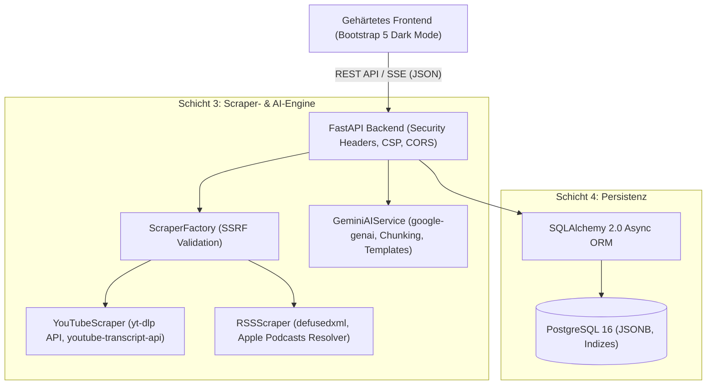

# Systemarchitektur & Modulübersicht

<!-- SPDX-License-Identifier: GPL-3.0-or-later -->
<!-- Copyright (C) 2026 Podcast & Media Channel Researcher Contributors -->

Dieses Dokument dient als zentrale Systemarchitektur-Dokumentation für Entwickler und KI-Agenten.

## 1. Systemübersicht

Der **Podcast & Media Channel Researcher & AI Analyzer** ist eine modulare, sicherheitsgehärtete Web-Applikation zur automatisierten Erfassung, Strukturierung und KI-gestützten Analyse von Podcasts und Medienkanälen (YouTube, RSS, Apple Podcasts).

## 2. Die 4 Schichten im Detail

### Schicht 1: Gehärtete Weboberfläche (Frontend)
- **Technologie:** Semantisches HTML5, Bootstrap 5 (`data-bs-theme="dark"`), Vanilla JavaScript, CSS3.
- **Sicherheitsmerkmale:**
  - Keine externen CDN-Abhängigkeiten (vollständig lokal unter `/static/vendor/` gebündelt).
  - Strikte Content Security Policy (`default-src 'self'`).
  - Schutz vor XSS durch strikte DOM-Sanitization und `textContent`/sichere DOM-Knoten-Erstellung.
- **Komponenten:**
  - **Archive Explorer Sidebar:** Liste aller erfassten Feeds mit Plattform-Badges (`[YouTube]`, `[RSS]`).
  - **Import- & Scraper-Panel:** URL-Eingabe mit client- und serverseitiger Validierung, Fortschrittsindikatoren.
  - **Episoden-Explorer:** Sortierbare, durchsuchbare Tabelle mit Volltextsuche in Show Notes & Metadaten.
  - **Detail-Drawer / Offcanvas:** Vollständige Show Notes, Kapitelmarken und Transkript-Viewer.
  - **Gemini Recherche-Labor:** 4 spezialisierte Arbeitsbereiche (Wikipedia-Wikitext, Gäste/Themen, Q&A, Freier Chat).
  - **Export-Center:** Schnelle Konvertierung und Download in CSV, JSON, Markdown und MediaWiki-Wikitext.

### Schicht 2: Recherche-Archiv & Explorer
- Verwaltet historische Analysen und ermöglicht das Durchsuchen von Tausenden Episoden und Transkripten.
- Schnelle Volltextfilterung und semantische Kontextbereitstellung für KI-Abfragen.

### Schicht 3: Modulare Scraper- & Analytik-Engine
- **Adapter-Pattern (`app/scrapers/`):**
  - `BaseScraper`: Abstrakte Schnittstelle für alle Plattformen mit typisierten DTOs (`PodcastInfo`, `EpisodeInfo`, `ChapterInfo`, `TranscriptInfo`).
  - `ScraperFactory`: Sichere Erkennung des Feed-Typs und Validierung der Ziel-URL gegen SSRF.
  - `YouTubeScraper`: Verwendet die interne Python-API von `yt-dlp` (keine Shell-Ausführung zur Vermeidung von Command Injection) und `youtube-transcript-api`.
  - `RSSScraper`: Verwendet `defusedxml` zur Absicherung von `feedparser` gegen XML-Bomben und XXE-Angriffe sowie eine iTunes-Lookup-Integration für Apple Podcasts.
- **Gemini AI Service (`app/gemini_service.py`):**
  - Nutzt das offizielle `google-genai` SDK.
  - Spezialisierte Prompt-Templates für Wikipedia-Tabellen, Gäste-Extraktion, Q&A und Deep Research.
  - Automatisches Token-Chunking für lange Transkripte.

### Schicht 4: Datenbank-Schicht (PostgreSQL 16)
- **ORM:** SQLAlchemy 2.0 mit vollständiger AsyncIO-Unterstützung (`asyncpg`).
- **Tabellen:**
  - `podcasts`: Kanaldaten, Plattform (`youtube`, `rss`, `apple`), Metadaten in JSONB.
  - `episodes`: Episodendaten, Show Notes, Kapitelmarken in JSONB, externe IDs.
  - `transcripts`: Zeitstempelbasierte Segmente in JSONB, Volltext und Sprachcode.
  - `ai_analyses`: Gespeicherte Analysen und Prompts pro Kanal/Episode.
- **Flexibilität:** Standardmäßig via isoliertem `postgres:16-alpine` Container in `docker-compose.yml`, umschaltbar auf jede externe PostgreSQL-Instanz via `DATABASE_URL`.

## 3. Datenfluss & Schnittstellen

1. **Scraping-Workflow:**
   `Client URL -> ScraperFactory.validate_url() -> Scraper.extract_all() -> Database commit -> Client SSE/JSON Update`
2. **AI-Analyse-Workflow:**
   `Client Request -> GeminiAIService.analyze(context, prompt_type) -> Token-Chunking -> Gemini API -> Database save -> Client Render`
3. **Export-Workflow:**
   `Client Export Request -> Data Aggregator -> Formatter (CSV/JSON/MD/Wikitext) -> File Stream Download`
